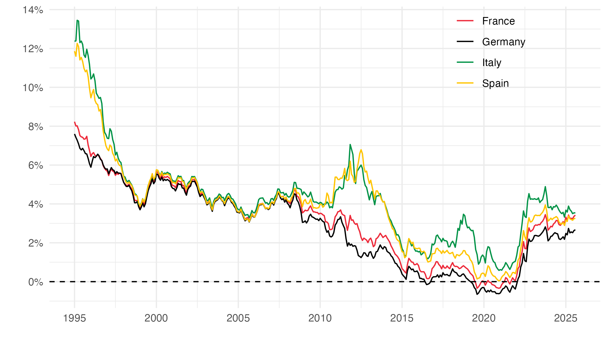

# Monetary Dialogue, September 2025

Monetary Dialogue between European Parliament's Committee on Economic and Monetary Affairs (ECON) and the European Central Bank (ECB), September 15 2025

Title: Dominance in Transition? The Future of the Dollar and the Euro

Authors: Christophe BLOT, Jérôme CREEL, François GEEROLF, Giovanni RICCO

## Replication

We provide files to replicate the data in [this working paper]():

### Figure 1: Exchange rates around the Plaza accords

[R code](R/figure1.R)

### Figure 6: Interest rates on long-term government bonds

[R code](R/figure6.R)

